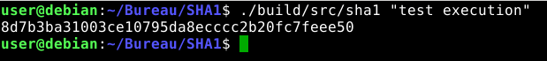
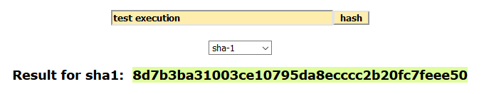

# SHA1

Cette implémentation de la fonction de hachage SHA-1 n'est pas optimale 
en mémoire. Elle a été réalisée lors de ma première année en informatique.

## Manuel utilisateur

- Pour compiler : 
```sh
make
```

- Pour exécuter, on met la chaîne de caractères à la suite : 
```sh
./build/src/sha1 test
```

Si la chaîne de caractères comporte plusieurs mots : 
```sh
./build/src/sha1 "test d'exécution"
```
## Exemple d'utilisation





